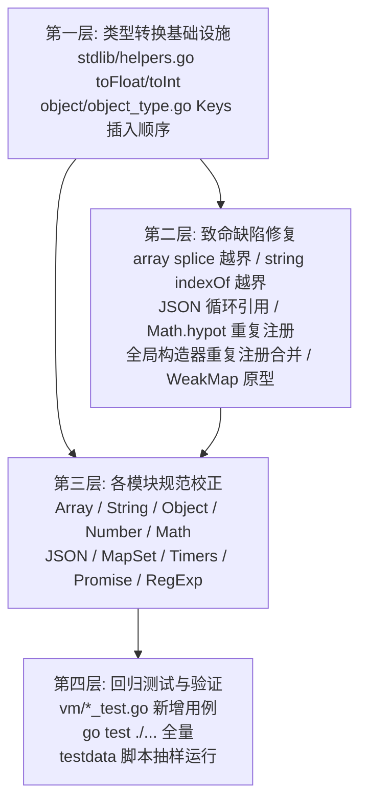
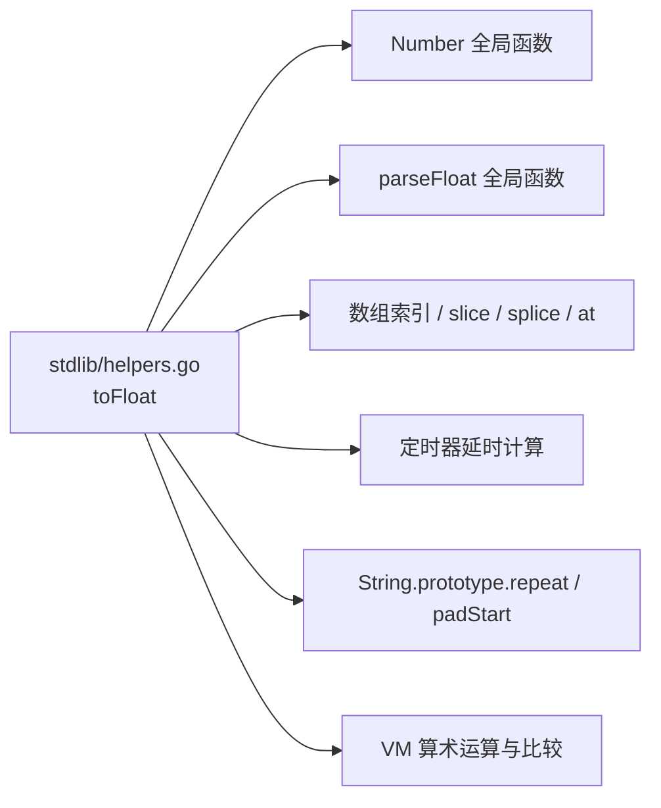

## 产品概述

`js-runtime` 是一个 Go 实现的 JavaScript 运行时（字节码 VM 架构），其 JavaScript 内置 API 以 Go 内建函数形式实现在 `stdlib/` 包中。本任务针对全项目 API 实现做系统审查并修复缺陷，涵盖参数校验、类型强制转换、原型方法语义、错误处理、集合与异步 API、注册机制六大方面。

## 核心功能

### 一、消除运行时崩溃（最高优先级）

- 修复 `Array.prototype.splice` 单参数调用时的切片越界 panic
- 修复 `String.prototype.indexOf` 的 fromIndex 上界未钳位导致的切片 panic
- 为 `JSON.stringify` 增加循环引用检测，避免无限递归栈溢出

### 二、修复注册覆盖导致的功能丢失

- 移除 `Math.hypot` 的重复注册（当前生效版本错误地返回平方和）与非标准 `Math.hypot2`
- 合并重复的全局 `Number` / `String` / `Boolean` 注册，恢复 `Number.MAX_VALUE`、`Number.MIN_VALUE`、`Number.parseInt`、`Number.parseFloat` 等静态成员

### 三、校正数值与字符串类型转换基础

- 重写 `toFloat`：改用严格解析，使 `Number("12px")` 返回 NaN、`Number("Infinity")` 返回 Infinity、`Number([])` 返回 0
- 重写 `parseInt` / `parseIntString`：支持尾随非法字符截断与 `0x` 前缀自动识别
- 修复 `toInt` 对 NaN/Infinity 的未定义行为与范围钳位

### 四、校正与 ECMAScript 规范偏离的语义

- `Array.prototype.sort` 默认改为字符串序；`indexOf`/`includes`/`lastIndexOf` 改用 SameValueZero 以支持 NaN
- 数组高阶方法补充 `thisArg` 参数；`reduce` 空数组无初值时抛 TypeError；非数组 this 抛 TypeError
- 字符串索引从"字节"改为"UTF-16 码元"，修复 `charAt`/`charCodeAt`/`at`/`substring`/`slice`/`split("")`/`padStart` 对非 ASCII 字符的处理
- `repeat` 负数抛 RangeError；`includes`/`startsWith`/`endsWith` 补齐位置参数；`replaceAll` 对非全局正则抛 TypeError
- `Object.entries` 支持数组；`Object.freeze` 真正冻结已有属性；`Object.defineProperty` 正确实现描述符语义
- `Map`/`Set` 补 `size`；`WeakMap`/`WeakSet` 补原型与方法；`setTimeout`/`setInterval` 支持向回调传参
- `Promise.race` 非可迭代参数改为 reject 而非永久 pending；`then` 支持 thenable 展开
- `RegExp.prototype.test` 在全局模式下推进 `lastIndex`

### 五、统一错误处理

- `JSON.parse` 错误统一使用 `SyntaxError` 名称
- 修复 `JSON.parse` reviver 的键名错误
- 原型方法 this 类型不匹配时抛 TypeError 而非静默返回默认值

### 六、补齐缺失 API 与回归测试

- 补充 `Object.seal`、`Object.getOwnPropertyDescriptor`、`String.raw`、`String.fromCodePoint`、`Math.imul`/`clz32`/`fround` 等常用 API
- 在 `vm/` 下新增/更新回归测试，锁定修复后的语义，最终全量 `go test ./...` 并抽样运行 `testdata/` 脚本验证

## 技术栈选型

沿用项目现有技术栈，不引入新依赖：

| 组件 | 技术 | 说明 |
| --- | --- | --- |
| 语言/运行时 | Go 1.26.2（`go.mod`），module `js-runtime` | 保持现状 |
| 值系统 | `object.Value` 接口 + `Object`/`Array`/`String`/`Number` 等具体类型 | 扩展而非重构 |
| API 实现 | `object.BuiltinFunction`（无 this）/ `object.BuiltinMethod`（有 this） | 复用现有注册范式 |
| 全局注册 | `stdlib.SetupGlobals()` → `runtime.Environment.Declare` | 需修正注册顺序与合并 |
| 错误机制 | `object.NewError` / `NewErrorWithName` / `NewTypeError` / `NewRangeError` + `BuiltinFunction.ReturnIsValue` | 复用现有 throwIfError 机制 |
| 回调桥 | `object.CallFunction` ← `vm` 在 `init()` 注册的 `SetCallFunction` | 保持现状 |
| 测试 | Go 标准 `testing` 包，位于 `vm/*_test.go` | 复用现有测试范式 |
| Unicode | 标准库 `unicode/utf8`、`unicode/utf16` | 新增，用于 UTF-16 码元索引 |


**关键决策**：UTF-16 索引改造采用"按需转换"而非"内部改用 UTF-16 存储"。JS 字符串内部仍是 Go 的 UTF-8 `string`，在需要按码元索引的方法（`charAt`/`charCodeAt`/`at`/`substring`/`slice`/`split("")`/`length`）内部临时转换。这样避免改动 `object.String` 的内存布局与所有现有调用点，影响面最小。

## 实现方案

采用**自底向上、按层分批**的修复策略：先修根因（类型转换基础设施），再修致命缺陷，最后按模块修规范偏差。每批修改配套回归测试，最后统一验证。

### 核心策略

1. **根因优先**：`stdlib/helpers.go` 的 `toFloat` 是所有数值转换的公共基础（被 `Number()`、`parseFloat()`、算术运算、数组索引、定时器延时等所有 API 依赖）。用 `fmt.Sscanf` 的截断解析是多个规范偏差的共同源头，必须最先修复，否则后续修复会被污染。

2. **注册去重**：`SetupGlobals()` 中 `setupNumberGlobal()` / `setupStringGlobal()` / `setupBooleanGlobal()` 与 `setupGlobalFunctions()` 存在同名重复 `Declare`（`runtime/environment.go:79-84` 的 `Declare` 直接覆盖 map）。方案是**在 `stdlib.go` 中移除重复的构造器注册调用，将静态成员统一合并到 `setupGlobalFunctions` 内的单一构造器对象上**，确保每个全局构造器只有一个注册点。

3. **属性顺序**：`object/object_type.go` 的 `Keys()` 当前用 `sort.Strings`。规范要求插入顺序（整数索引键升序优先）。方案是在 `Object` 中增加 `InsertOrder []string` 字段记录插入顺序，`Keys()` 按"整数索引键升序 + 其余按插入顺序"返回；`Inspect()` 保持排序输出以维持现有测试期望。**这是唯一涉及结构体的改动，需保证零值兼容**（`InsertOrder` 为 nil 时回退到排序行为）。

4. **UTF-16 索引**：在 `stdlib` 新增辅助函数，将 Go UTF-8 字符串转为 `[]uint16` 后索引，再转回 UTF-8。集中在一处实现，所有字符串方法复用，避免逻辑分散。

5. **错误处理统一**：新增两个辅助构造器，供所有原型方法复用：

- `thisTypeError(method string, this Value) Value` — 生成 `X.prototype.y called on incompatible receiver` 类型的 TypeError
- 对已有静默返回默认值的位置，逐个替换为抛错

## 实现要点（执行细节）

### 性能考量

- **`toFloat` 是热路径**：每次算术运算、数组索引、比较都会调用。改用 `strconv.ParseFloat(strings.TrimSpace(s), 64)` + 先做 Fast Path 判断（`len(s) == 0` 直接返回 0、首字符非数字/符号直接返回 NaN），避免对每个字符串都分配。相比 `fmt.Sscanf`（基于反射，开销大），`strconv.ParseFloat` 反而**更快**，这是一次性能净收益。
- **UTF-16 转换只在需要时发生**：`split("")`、`charAt` 等方法对纯 ASCII 字符串可走快速路径（`utf8.RuneCountInString(s) == len(s)` 时直接按字节索引），避免 `[]uint16` 分配。
- **`JSON.stringify` 的循环引用检测**：用 `map[*object.Object]bool` / `map[*object.Array]bool` 记录当前递归路径（而非全局 visited 集合），这样同一个对象在不同分支重复出现是合法的（如 `{a: x, b: x}`），只有路径上的环才报错。路径集合在递归返回时删除，空间复杂度 O(深度)。
- **`Object.InsertOrder`**：写入时追加；`DeleteProperty` 时从切片移除（O(n)，但属性删除不是热路径）。对 `Keys()` 的整数索引排序，只在存在整数键时才做，避免无谓开销。

### 稳定性与向后兼容

- **不破坏现有测试**是硬性约束。`vm/` 下 9 个测试文件 + `object/object_test.go` 必须全部通过。
- `Object.Keys()` 改为插入顺序后，`Object.Inspect()` 仍需排序输出（现有测试可能依赖 `{ a: 1, b: 2 }` 的固定格式），两者需分离。
- `sort` 改为字符串序会影响 `testdata/` 下的脚本输出，需抽样运行验证。

### 风险控制

- 每批修改后立即跑 `go build ./...` + `go test ./...`，避免问题累积。
- `toFloat` 改动影响面最大，需重点回归 `syntax/`、`syntax2/`、`syntax3/` 下的脚本。
- 不修改 `docs/` 中记录的已知限制（await rejected Promise 的 try/catch 问题）对应的实现，除非确认受本次改动影响。

## 架构设计

### 修复层次与依赖顺序



### 分层职责

| 层次 | 职责 | 关键文件 |
| --- | --- | --- |
| 基础设施层 | 数值强制转换、字符串索引原语、属性枚举顺序 | `stdlib/helpers.go`、`stdlib/unicode.go`（新增）、`object/object_type.go` |
| 注册层 | 全局构造器的单一注册点，消除覆盖 | `stdlib/stdlib.go`、`stdlib/object_methods.go` |
| API 实现层 | 各内置对象的原型方法与静态方法 | `stdlib/array_methods.go`、`string_methods.go`、`object_methods.go`、`number_methods.go`、`math.go`、`json.go`、`map_set.go`、`timers.go`、`promise.go`、`regexp.go` |
| 验证层 | 回归测试与脚本验证 | `vm/*_test.go`、`testdata/` |


### 数据流（以 `toFloat` 为例说明根因影响面）



## 目录结构

本次修改涉及以下文件（全部位于 `f:/desktop/go`）：

```
f:/desktop/go/
├── stdlib/
│   ├── helpers.go              # [MODIFY] 重写 toFloat（改用 strconv.ParseFloat + 快速路径，修正 "12px"→NaN、
│   │                           #          "Infinity"→Infinity、[]→0、[5]→5）；重写 toInt（处理 NaN/Inf 与范围钳位）；
│   │                           #          新增 thisTypeError 辅助构造器供原型方法复用
│   ├── unicode.go              # [NEW] UTF-16 码元索引辅助：toUTF16 / fromUTF16 / charAtUTF16 / substringUTF16
│   │                           #       等，供 string_methods.go 与 array_methods.go（Array.from）复用；
│   │                           #       纯 ASCII 走快速路径避免分配
│   ├── stdlib.go               # [MODIFY] 移除 setupNumberGlobal/setupStringGlobal/setupBooleanGlobal 的独立
│   │                           #          Declare 调用，将静态成员合并进 setupGlobalFunctions 中的单一构造器，
│   │                           #          消除同名覆盖导致的成员丢失
│   ├── array_methods.go        # [MODIFY] 修复 splice 越界 panic；sort 默认改字符串序；
│   │                           #          indexOf/includes/lastIndexOf 改 SameValueZero 支持 NaN；
│   │                           #          高阶方法补 thisArg；reduce 空数组抛 TypeError；
│   │                           #          非数组 this 抛 TypeError；flat 支持 Infinity/负数；
│   │                           #          Array.from 修 nil 空洞并支持 mapFn/Set/Map
│   ├── string_methods.go       # [MODIFY] charAt/charCodeAt/at/substring/slice/split("")/padStart 改 UTF-16 索引；
│   │                           #          indexOf 钳位 fromIdx 上界（修 panic）；charCodeAt 越界返回 NaN；
│   │                           #          repeat 负数抛 RangeError 并防护 Infinity；
│   │                           #          includes 补 fromIndex、startsWith/endsWith 补 position；
│   │                           #          replaceAll 对非全局正则抛 TypeError；trimStart/End 补空白字符集
│   ├── object_methods.go       # [MODIFY] 合并全局构造器注册（恢复 Number.MAX_VALUE/MIN_VALUE/parseInt/
│   │                           #          parseFloat）；Object.entries 支持数组；freeze 真正冻结已有属性；
│   │                           #          defineProperty 实现描述符语义（复用 object/accessor.go 的 Accessor）；
│   │                           #          getOwnPropertyDescriptors 不再硬编码标志；
│   │                           #          修正 Number.isNaN/isInteger/isFinite 语义；
│   │                           #          keys/values/entries 支持 String；intToString 改用 strconv.Itoa；
│   │                           #          新增 Object.seal / getOwnPropertyDescriptor / hasOwnProperty
│   ├── number_methods.go       # [MODIFY] toFixed/toPrecision/toString 对非 Number this 抛 TypeError；
│   │                           #          toExponential 校验 digits 范围 0-100
│   ├── math.go                 # [MODIFY] 删除重复的 hypot 与非标准 hypot2，保留正确实现；
│   │                           #          补充 imul / clz32 / fround / log1p / expm1 / sinh / cosh / tanh / EPSILON
│   ├── json.go                 # [MODIFY] stringify 增加递归路径环检测（抛 TypeError）；
│   │                           #          parse 错误改用 NewErrorWithName("SyntaxError", ...)；
│   │                           #          修复 applyReviver 的键名错误；删除死代码 parseFloatString 与
│   │                           #          var _ = fmt.Sprintf hack
│   ├── map_set.go              # [MODIFY] Map/Set 补 size 属性；WeakMap/WeakSet 补 prototype 注册与方法
│   ├── timers.go               # [MODIFY] setTimeout/setInterval 支持 args[2:] 透传给回调
│   ├── promise.go              # [MODIFY] race/allSettled 参数非可迭代时 reject TypeError（避免永久 pending）；
│   │                           #          then 支持 thenable 展开；补充 Promise.any
│   └── regexp.go               # [MODIFY] test 在 g/y 标志下推进 lastIndex；
│   │                           #          修正 expandReplacement 的 $`/ $' 与 $n 回退逻辑；
│   │                           #          prototype 补 source/flags/global/ignoreCase/multiline/lastIndex
├── object/
│   └── object_type.go          # [MODIFY] 增加 InsertOrder 字段记录属性插入顺序；
│                               #          Keys() 按「整数索引键升序 + 其余插入顺序」返回（InsertOrder 为 nil
│                               #          时回退排序行为保证兼容）；Inspect() 保持排序输出
└── vm/
    ├── vm_stdlib_api_test.go   # [NEW] 本次所有修复的回归测试，按模块分组：
    │                           #       数值转换、Array、String、Object、Number、Math、JSON、MapSet、
    │                           #       Timer、Promise、RegExp
    └── （已有测试文件）          # [VERIFY] vm_test.go / vm_builtin_error_test.go / vm_timer_promise_test.go /
                                #          vm_regexp_test.go / vm_proxy_test.go / vm_strict_timer_test.go /
                                #          stdlib_test.go 等，需确保全部通过
```

## 关键代码结构

以下是跨模块依赖的核心契约，需精确定义：

```
// stdlib/helpers.go —— 数值强制转换核心，所有 API 依赖
// 规范要求（ECMAScript ToNumber）：
//   Number("") -> 0, Number(" 42 ") -> 42, Number("12px") -> NaN,
//   Number("Infinity") -> +Inf, Number("-Infinity") -> -Inf,
//   Number([]) -> 0, Number([5]) -> 5, Number([1,2]) -> NaN,
//   Number(null) -> 0, Number(undefined) -> NaN, Number(true) -> 1
// 实现要点：先走类型分支，字符串分支用 strconv.ParseFloat(TrimSpace(s), 64)，
// 并对 "Infinity"/"-Infinity"/十六进制 "0x..." 做特判。
func toFloat(v object.Value) float64

// stdlib/helpers.go —— 原型方法 this 类型错误统一构造器
// 生成形如 "Array.prototype.push called on incompatible receiver" 的 TypeError，
// 供所有原型方法在非法的 this 上复用，替代当前静默返回默认值的写法。
func thisTypeError(proto, method string, this object.Value) object.Value

// stdlib/unicode.go —— UTF-16 码元索引辅助（新增）
// JS 字符串按 UTF-16 码元索引，而 Go 内部是 UTF-8 字节串。
// 纯 ASCII（utf8.RuneCountInString(s) == len(s)）时直接按字节索引，避免分配。
func toUTF16(s string) []uint16          // UTF-8 -> UTF-16 码元序列
func fromUTF16(u []uint16) string        // UTF-16 码元序列 -> UTF-8
func charCodeAtUTF16(s string, idx int) (code float64, ok bool) // ok=false 表示越界，应返回 NaN

// stdlib/json.go —— 带环检测的序列化
// seen 记录当前递归路径（进入时加入、返回时删除），同一对象在不同分支重复出现是合法的。
// 检测到环时返回 object.NewErrorWithName("TypeError", "Converting circular structure to JSON")
func jsValueToJSONIndent(v object.Value, currentIndent, indent string,
    replacerArr []string, replacerFn object.Value, key string,
    seen map[object.Value]bool) string
```

## Agent Extensions

### SubAgent

- **code-explorer**
- **用途**：在实现各模块修复前，对本次未逐行审查的文件做补充核查 —— `stdlib/reflect_proxy.go`、`stdlib/symbol.go`、`stdlib/async.go`、`stdlib/console.go`、`stdlib/strict_timers.go`、`stdlib/stats.go`、`object/promise.go`、`object/timer.go`、`object/strict_timer.go`、`object/proxy.go`、`object/regexp.go`、`object/array.go`、`object/error.go`、`object/callback.go`
- **预期产出**：输出与已确认清单同格式的结构化问题清单（文件名:行号 + 代码片段 + 问题描述 + 严重度 + 建议修法），重点识别会导致 panic、死锁、goroutine 泄漏、回调异常丢失的缺陷，以及同类"静默返回默认值而非抛 TypeError"的模式